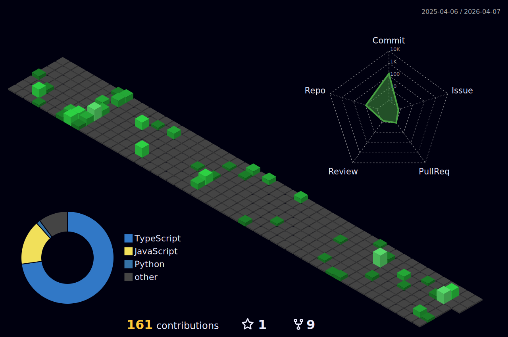
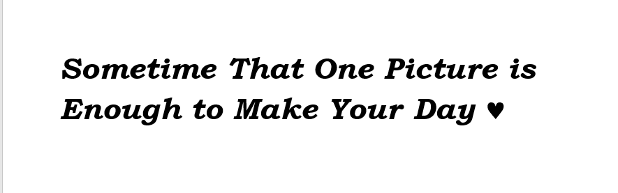

  

<!-- make it mobile safe... -->

#### _नमस्ते Hello こんにちは,_
#### _I am_

#### _Always building and learning something new 🔥._  
#### _I have hands-on experience with HTML, CSS, JavaScript, TypeScript, React, Node.js, Next.js, Framer Motion and I enjoy building clean, responsive, user-friendly, animated web interfaces._  
#### _I am excited about opportunities to join teams and contribute to projects while continuing to learn and grow as a developer._

 

<h3 align="center"><i>Stats</i></h3>

  
  
   
  
   
  

<h3 align="center"><i>Tech</i></h3>

  
  
  
  
  
  
  
  
  
  
  
  
  
  
  

<h3 align="center"><i>Social</i></h3>

  
  
  
  
  
  

###

<h2 align="center"><i>Beside Coding 👀</i></h2>

###

<h3 align="center"><i>Some Fun...</i></h3>

<h3 align="center"><i>Some Writing...</i></h3>

  
  
  

<h3 align="center"><i>Some Listing...</i></h3>

  

<h3 align="center"><i>Some Dreaming...</i></h3>

  
  

 

###

<i>______________________________________________</i>

<b><i>Imagination has no limit!</i></b>

<i>______________________________________________</i>

  

